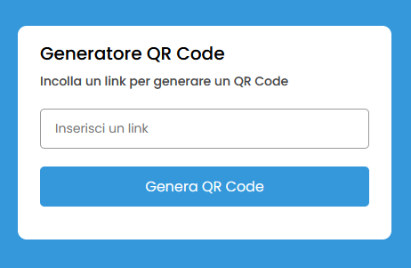
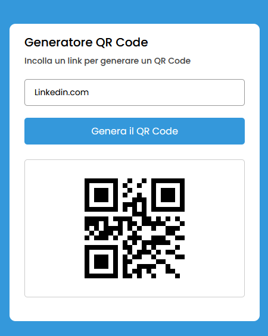

# Progetto Javascript QR Code Generator

Una semplice web app di un QR Code generator sviluppato grazie a una API esterna. Linguaggi utilizzati per la creazione

- HTML (Markup)
- CSS (Markup)
- JAVASCRIPT

API presa da :

- link : **https://goqr.me/api/**

Condizione iniziale dell'app

Condizione finale dell'app, dopo che ha generato il QR Code

